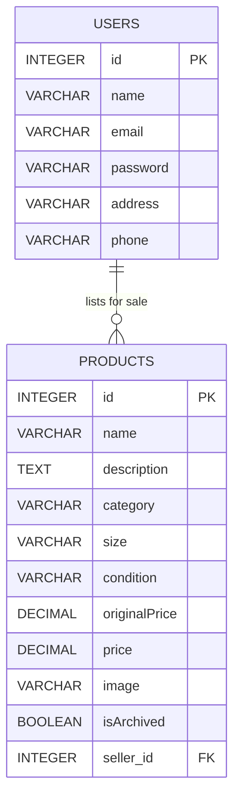
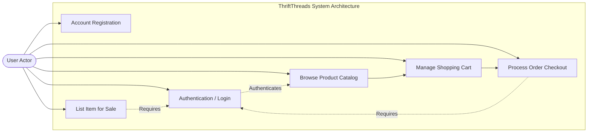
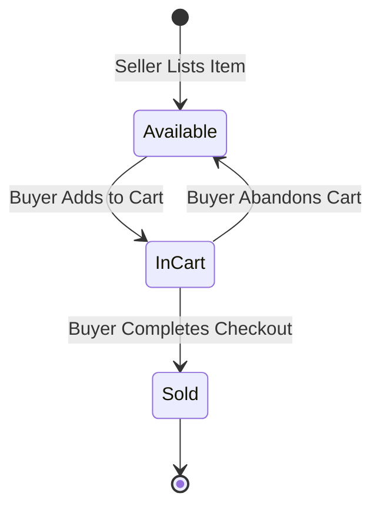
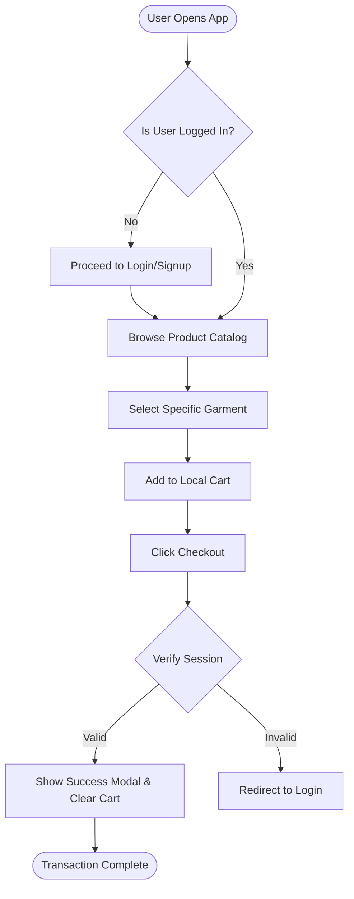
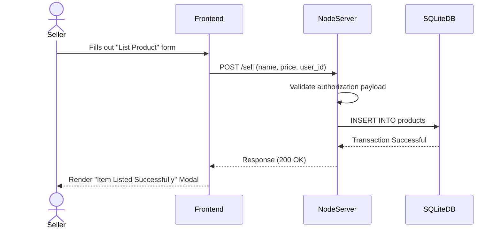

# Project Report: ThriftThreads

## Chapter 1. Introduction

The rapid acceleration of the digital economy has fundamentally transformed consumer retail, yet the secondhand apparel market remains largely fragmented and technologically underserved. **ThriftThreads** emerges as an innovative, purpose-built e-commerce ecosystem designed to bridge this gap. By leveraging modern web development architectures, the platform democratizes sustainable fashion, empowering individuals to seamlessly browse, purchase, and sell pre-loved garments within a single, highly curated digital marketplace.

### Objectives
The core target of the **ThriftThreads** initiative is to develop a sustainable, user-centric e-commerce platform dedicated to exchanging gently used clothing. Specific objectives include:
- **Environmental Mission**: Actively combat fast fashion and textile waste by hosting a frictionless "circular economy" digital marketplace.
- **Technical Architecture**: Build a blazing-fast, responsive web interface utilizing purely optimized HTML5, CSS3, and Vanilla Javascript without the bloat of heavy frontend frameworks.
- **Accessibility**: Eliminate barriers for independent sellers by providing an intuitive, lightning-fast "Sell" portal connected to a unified SQL database.

### Problem Statement
While consumer demand for sustainable, secondhand fashion has surged to combat the environmental damage of the global apparel industry, existing digital infrastructure remains disjointed. Consumers lack a sleek, dedicated platform to thrift apparel seamlessly, as legacy marketplaces are often visually chaotic and physically constrained. Simultaneously, independent sellers are actively discouraged by modern platforms that impose exorbitant transaction fees and bloated user interfaces, creating a stark need for a frictionless, localized, and unified secondhand marketplace.

### Scope
The scope of this project strictly encompasses the successful development of a full-stack **Minimum Viable Product (MVP)**. It focuses extensively on core retail loops and relational database integrity.

**In-Scope Features:**
- **Asynchronous Authentication**: Secure user session state management utilizing unified navigation headers and local browser token storage.
- **Dynamic Storefront**: A searchable product catalog powered by recursive SQLite queries and responsive CSS Grid logic.
- **Shopping Cart Engine**: A fully persistent shopping cart capable of handling real-time mathematical calculations completely client-side.
- **Selling Funnel**: An integrated listing portal allowing authenticated users to write directly to the public REST API catalog safely.

**Out-of-Scope Elements (Future Horizons):**
- Real-world financial payment gateway processing (e.g., Stripe implementations).
- Physical third-party shipping and tracking API integrations.
- In-app WebSocket peer-to-peer messaging.

---

## Chapter 2. System Analysis

### Existing System
The existing landscape for acquiring secondhand apparel is deeply polarized between physical and digital extremes, both of which suffer from significant structural inefficiencies:
1. **Physical Thrift Stores**: Traditional brick-and-mortar thrift shops are severely geographically constrained. They rely entirely on localized foot traffic and manual sorting, making it practically impossible for consumers to efficiently search for specific sizes, brands, or clothing conditions.
2. **Generalized Classified Platforms**: Platforms like Craigslist or Facebook Marketplace host secondhand clothing but lack dedicated fashion-oriented aesthetic curation. Their generalist approach results in visually chaotic interfaces, inconsistent product data, and a complete absence of standard e-commerce features like unified shopping carts.
3. **Corporate Resale Apps**: While dedicated resale apps (e.g., Poshmark, Depop) exist, they are increasingly defined by exorbitant transaction fees, aggressively algorithm-driven feeds that suppress casual sellers, and bloated user interfaces that overwhelm users attempting to make simple local transactions.

### Proposed System
**ThriftThreads** is a specialized digital marketplace meticulously designed to solve the inefficiencies of the secondhand apparel industry. The proposed system seamlessly merges the accessibility of digital classifieds with the polished experience of a modern e-commerce platform.

Key functional pillars include:
- **Unified Aesthetic Architecture**: Employs a custom-built, centralized CSS design system to guarantee visual consistency and responsive behavior across all device dimensions.
- **Asynchronous Access Control**: Features dynamic navigation headers that intelligently manage local user sessions, offering personalized dashboards for authenticated buyers and sellers.
- **High-Performance Catalog**: Utilizes a relational SQLite database paired with CSS Grid layouts to deliver instantaneous, high-resolution product browsing without bloated navigation trees.
- **Client-Side Cart Engine**: Drastically lowers server overhead by executing full shopping cart mathematics (pricing, quantities, and totals) natively within the browser's persistent `localStorage`.
- **Democratized Seller Funnel**: Features a zero-friction, form-based "Sell" portal, allowing any verified user to instantly pivot from a consumer to an active marketplace supplier.

### Hardware Requirements
- **Processor**: Intel Core i3 / AMD Ryzen 3 (or equivalent mobile processor)
- **RAM**: 4 GB minimum
- **Storage**: Minimum 500 MB free space for local deployment
- **Network**: Standard Broadband / 4G Internet Connectivity for cloud interaction

### Software Requirements
- **Operating System**: Windows 10/11, macOS, or Linux distribution.
- **Runtime Environment**: Node.js (v14.0.0 or higher).
- **Database Architecture**: SQLite3.
- **Backend Framework**: Express.js (HTTP Routing & Server Management).
- **Frontend Stack**: HTML5, CSS3, Vanilla JavaScript (ES6+).
- **Client**: Any modern web browser (Google Chrome, Firefox, Safari, Edge).

### Justification of Selection of Technology

**1. HTML5 & Vanilla CSS3 (Frontend Presentation)**
To avoid the bloat of heavy libraries (like Bootstrap), the platform is styled purely utilizing semantic HTML5 and Vanilla CSS3 paired with centralized CSS Variables. This guarantees precise, instantaneous rendering and avoids generic layout-shifting issues.

**2. Vanilla JavaScript (ES6+)**
Opting out of monolithic frontend frameworks (such as React) dramatically reduces the immediate payload footprint. Modern Vanilla JS executes direct DOM manipulation and asynchronous fetch requests with blistering speed, guaranteeing the minimal load times critical for e-commerce.

**3. SQLite3 (Database Engine)**
SQLite is a serverless, zero-configuration database that securely stores the entire relational dataset in a single portable file. It fully supports ACID transactions to prevent data corruption, avoiding the administrative overhead of heavier localized servers like PostgreSQL.

**4. Web Storage API (`localStorage`)**
Instead of repeatedly hitting the backend to fetch uncommitted shopping carts, the system utilizes HTML5 `localStorage`. This creates a persistent, client-side caching matrix that processes cart arithmetic securely offline, drastically slashing server load during standard browsing.

**5. Node.js (Runtime Environment)**
Selected for its non-blocking, event-driven architecture, Node.js provides exceptional I/O concurrency. It handles simultaneous database queries effortlessly, while its unified use of JavaScript across the entire stack actively accelerates the development lifecycle.

**6. Express.js (Backend Framework)**
This minimalist web framework was chosen to rapidly structure the platform's RESTful API. Express massively simplifies HTTP routing, static file housing, JSON payload parsing for secure authentication, and handling complex seller database uploads.

---

## Chapter 3. System Design

### 3.1 Entity-Relationship (E-R) Diagram
The Entity-Relationship (E-R) Diagram securely models the core relational logic between the platform's independent Users and the physical Products they list into the SQL database. The `USERS` table acts as the primary entity holding authentication details, while the `PRODUCTS` table holds specific inventory tracking nodes linked natively via a strict `seller_id` foreign key.

### 3.2 UML Diagrams

#### 1. Use Case Diagram
The Use Case Diagram visualizes the interactive behavioral pathways between the primary actor (the User) and the core modules of the ThriftThreads ecosystem. It defines exactly what domain actions a visitor can perform versus a securely authenticated user.

#### 2. Statechart Diagram
The Statechart Diagram tracks the dynamic lifecycle of a single secondhand garment from its initial creation state to its final purchasing resolution, cleanly defining how the platform flags active storefront inventory.

#### 3. Activity Diagram
The Activity Diagram maps the sequential operational workflow required for a user to successfully navigate the platform and execute a transaction. It explicitly outlines the routing logic and highlights conditional decision nodes (like Authentication validation) that act as strict platform state gates.

#### 4. Sequence Diagram
The Sequence Diagram models the exact chronological exchange of data payloads between the User, the interactive DOM Frontend, the Node.js API Server, and the SQLite Database during the successful execution of the core "Product Listing" action.

---

## Chapter 4. Future Enhancement
To scale the ThriftThreads MVP into a highly robust, global enterprise application, the following strategic enhancements are proposed:
1. **Cloud Database Migration**: Migrating from local SQLite to a highly available, distributed relational cluster (like PostgreSQL) to handle millions of concurrent user transactions, data backups, and horizontal scaling.
2. **Third-party Payment Integration**: Replacing the emulated checkout logic with secure, PCI-compliant financial architecture using the Stripe or PayPal APIs to process real debit/credit card payments.
3. **Cloud Media Hosting**: Integrating edge-hosted AWS S3 buckets to natively host user-uploaded product photos directly, removing the platform's reliance on users pasting external web URLs.
4. **Server-Side Session Persistence**: Transitioning the shopping cart tracking from local browser memory (`localStorage`) to server-backed database sessions. This allows users to safely log in and retrieve their exact shopping cart across multiple different devices.
5. **Real-Time Communication**: Developing an integrated WebSocket chat system (using Socket.io) to allow direct negotiations and question-answering between thrift buyers and independent item sellers globally.

---

## Chapter 5. Reference And Bibliography
1. **Mozilla Developer Network (MDN) Web Docs**: *Comprehensive architectural practices for modern HTML, CSS, and standardized JavaScript DOM manipulation.* (https://developer.mozilla.org/)
2. **Node.js Official Documentation**: *Platform API references for handling filesystem streams, backend environments, and asynchronous network processing.* (https://nodejs.org/docs/)
3. **Express.js Documentation**: *Guidelines on constructing efficient HTTP traffic middleware, securely parsing JSON payloads, and configuring scalable API routes.* (https://expressjs.com/)
4. **SQLite Official Guidelines**: *Syntax directives for defining relational tables, mapping safe foreign keys, executing queries, and protecting against SQL injection architecture.* (https://www.sqlite.org/docs.html)
5. **Mermaid.js Documentation**: *Syntax architecture for dynamically rendering Entity-Relationship components and structural UML graph documentation.* (https://mermaid.js.org/)
